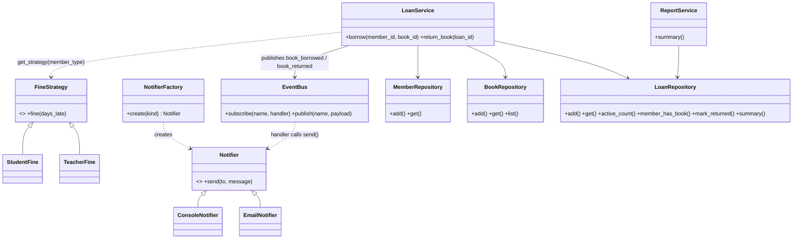

# UML class diagram (paste at mermaid.live, or view directly on GitHub)

```mermaid
classDiagram
    class FineStrategy { <<abstract>> +fine(days_late) }
    FineStrategy <|-- StudentFine
    FineStrategy <|-- TeacherFine

    class Notifier { <<abstract>> +send(to, message) }
    Notifier <|-- ConsoleNotifier
    Notifier <|-- EmailNotifier
    class NotifierFactory { +create(kind) Notifier }
    NotifierFactory ..> Notifier : creates

    class EventBus { +subscribe(name, handler) +publish(name, payload) }
    EventBus ..> Notifier : handler calls send()

    class LoanService { +borrow(member_id, book_id) +return_book(loan_id) }
    LoanService --> MemberRepository
    LoanService --> BookRepository
    LoanService --> LoanRepository
    LoanService --> EventBus : publishes book_borrowed / book_returned
    LoanService ..> FineStrategy : get_strategy(member_type)

    class ReportService { +summary() }
    ReportService --> LoanRepository

    class MemberRepository { +add() +get() }
    class BookRepository { +add() +get() +list() }
    class LoanRepository { +add() +get() +active_count() +member_has_book() +mark_returned() +summary() }
```
